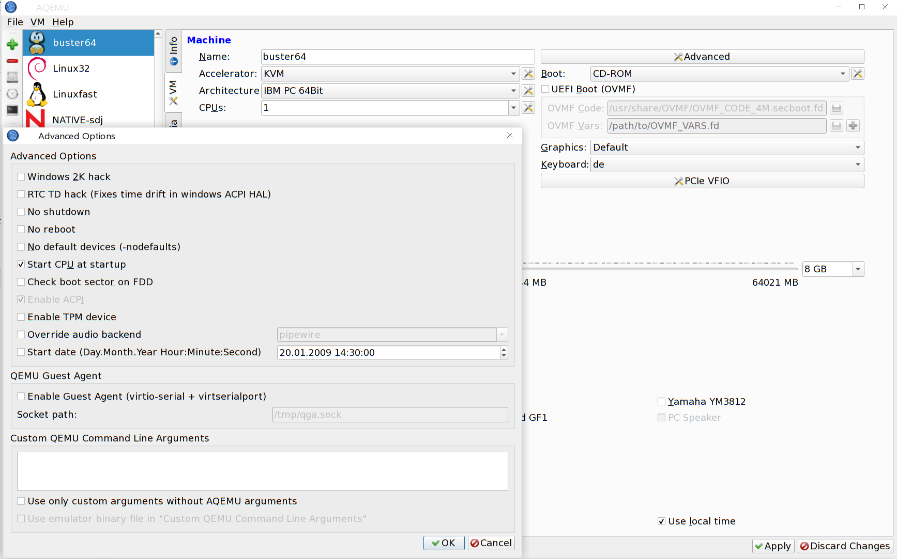
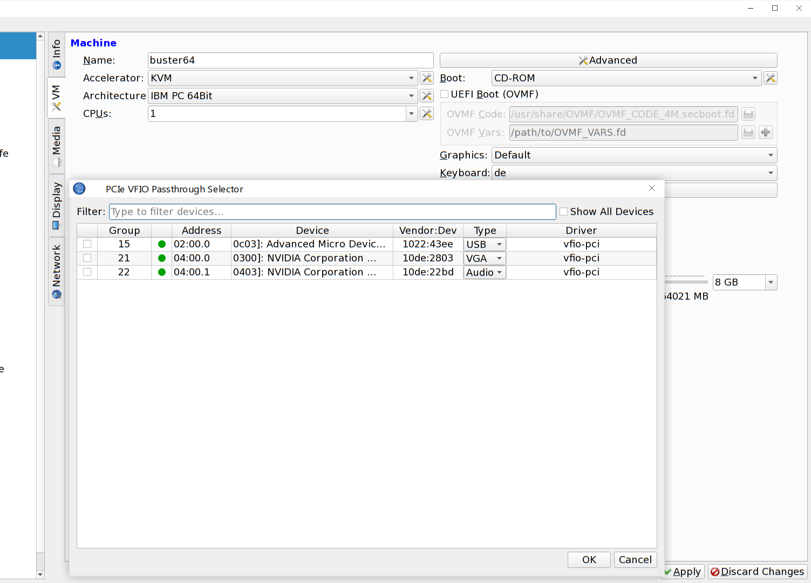
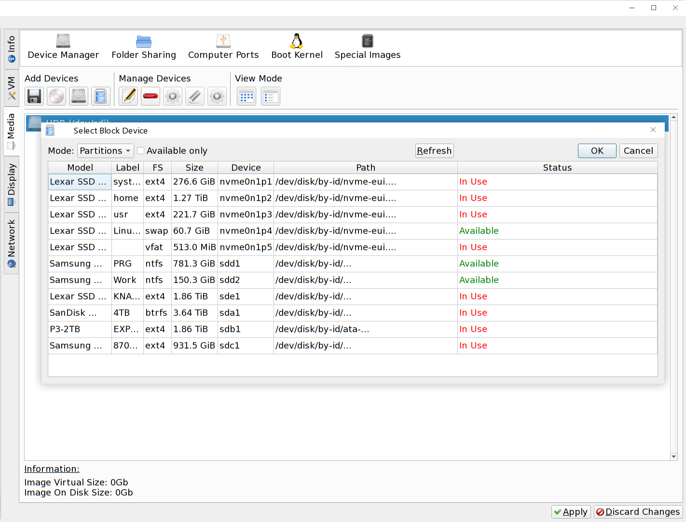
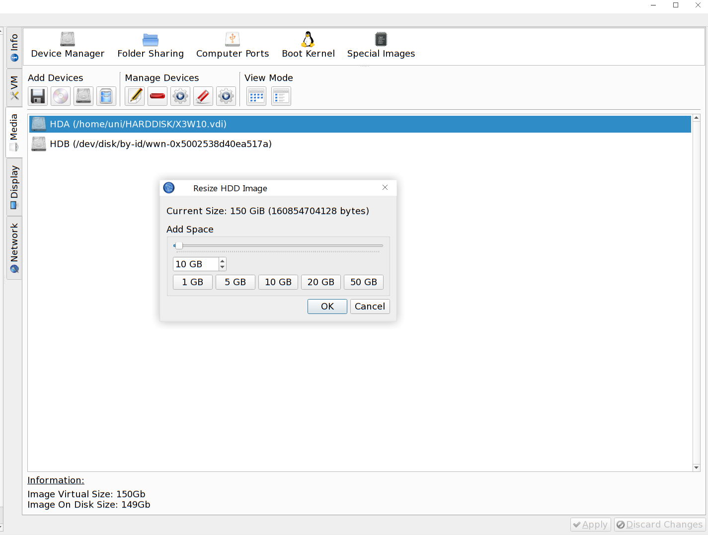

### What's new in 0.9.8 (May 2026)

**UEFI & Modern OS Support**
- UEFI (OVMF) firmware with Secure Boot toggle
- Windows 10/11 VM templates (Secure Boot, TPM 2.0, 4+ GB RAM presets)

**TPM (Trusted Platform Module)**
- Full TPM 2.0 device setup via swtpm backend
- Automatic `-chardev` + `-tpmdev` QEMU argument generation

**VFIO PCIe Passthrough**
- Dedicated VFIO passthrough editor: browse host PCI devices, IOMMU groups, driver status
- Auto-generates `vfio-pci` device args + `ioh3420` root ports
- Per-device flags: multifunction, x-vga, ROM file, disable VGA/idle

**Storage**
- **Resize HDD Image** dialog – grow qcow2/VDI images by 1–1024 GB
- Native block device selector (`/dev/` paths)
- Storage bug fixes and format UI improvements

**CPU & Performance**
- CPU flags editor with presets
- SMP topology auto-fill with QEMU 9.x validation
- Hyperthreading toggle
- Hyper-V enlightenments for Windows guests

**Usability**
- SMB quick share setup
- Deduplicated Machine Type dropdown
- Modern QEMU audio device detection
- Clean, **warning-free build** (Meson & CMake, 0 warnings)

**Packaging**
- Debian packaging script with proper `--prefix=/usr`, `DESTDIR`, dependency handling

Example how to build using meson/ninja:
```
meson builddir
cd builddir
ninja
./aqemu
```







Based on AQEMU — a Qt5 frontend for QEMU with optional embedded VNC display and DBus service.

---

Use cmake to build.

Dependencies: 
 - Qt5Core
 - Qt5Widgets 
 - Qt5Network
 - Qt5Test
 - Qt5PrintSupport
 - Qt5DBus
 - LibVNCServer


---

As an alternative to cmake the meson build system is also supported:
https://github.com/mesonbuild/meson

